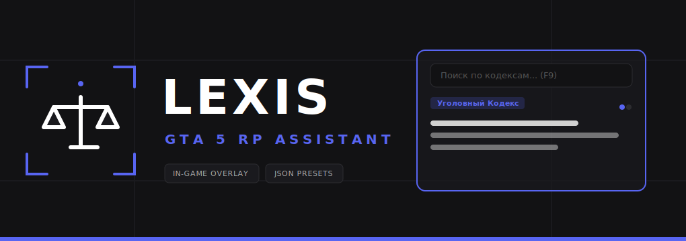

# Lexis - Памятка для GTA 5 RP

  

  <a href="EULA.md">📄 Пользовательское соглашение (EULA)</a>

**Lexis** — это удобный настольный справочник законодательства, созданный специально для игроков ролевых серверов GTA 5 RP (и аналогичных проектов). Программа предназначена для сотрудников государственных структур (LSPD, FIB, GOV и др.), адвокатов и юристов, которым необходим моментальный доступ к статьям кодексов во время напряженных игровых ситуаций.

## 🚀 Основные возможности

* **Игровой Оверлей (Overlay):** Быстрый доступ к базе законов по горячей клавише (по умолчанию `F9`), без необходимости сворачивать игру. Окно отображается поверх других окон.
* **Умный Парсер:** Автоматическое разбиение скопированного текста кодекса на отдельные статьи.
* **Умная подсветка синтаксиса:** Ключевые слова (наказания, номера статей, пункты) выделяются цветом для мгновенного считывания.
* **Редактор базы:** Встроенная админ-панель для ручного добавления, изменения и удаления законов.
* **Импорт и Экспорт:** Возможность легко делиться своими готовыми пресетами законов (в формате JSON) с другими игроками.

## 🛠 Принцип работы (Под капотом)

Программа представляет собой Desktop-приложение, написанное на языке **Python**.

* **Графический интерфейс:** Построен на базе мощного фреймворка **PyQt5**. Оверлей реализован как безрамочное полупрозрачное окно (`Qt.FramelessWindowHint` + `WA_TranslucentBackground`).
* **Глобальные хоткеи:** Взаимодействие с клавиатурой (вызов оверлея из игры) реализовано через библиотеку `keyboard`.
* **Локальное хранение:** База данных законов хранится локально в формате `JSON`. Это обеспечивает мгновенный отклик, позволяет работать оффлайн и облегчает передачу пресетов между пользователями.
* **Безопасность:** Программа не внедряется в память игры, а работает как независимое оконное приложение, что исключает вероятность блокировок античитами.

## 📥 Как скачать

Данный репозиторий носит информационный характер (закрытый исходный код). Скачать актуальные и скомпилированные `.exe` версии (установщик или портативную версию) вы можете на нашем официальном Discord-сервере.

## 🛡️ Информация о безопасности (Отчеты VirusTotal)

Некоторые эвристические антивирусы (особенно алгоритмы машинного обучения, такие как **Acronis Static ML**, **Bkav Pro**, **SecureAge**, **Yandex** и **NANO-Antivirus**) могут помечать установочный или портативный `.exe` файл как вредоносный (например, `Riskware.PyInstaller!1RGqocu5ZvU`, `Wacatac` или `Trojan.Win32.Mlw`).

**Это 100% ложное срабатывание (False Positive). Почему это происходит:**
1. **PyInstaller/Nuitka:** Наша программа написана на языке Python и скомпилирована в один самостоятельный `.exe` файл. Антивирусы (особенно такие как *Yandex*) видят упаковщик PyInstaller/Nuitka и автоматически помечают файл подозрительным, так как некоторые злоумышленники используют упаковщики для скрытия своего кода.
2. **Глобальный бинд (Клавиатура):** Программа использует модуль `keyboard`, чтобы вы могли нажать **F9** прямо внутри GTA 5 для вызова прозрачного оверлея. Перехват нажатий клавиатуры в Windows (глобальные хуки) — это та же технология, которую используют клавиатурные шпионы (кейлоггеры). Именно поэтому алгоритмы *Static ML* бьют ложную тревогу.
3. **Отсутствие платного сертификата:** У программы пока нет платной цифровой подписи разработчика (Code Signing Certificate), поэтому защитные системы (например, Windows SmartScreen) не доверяют новому файлу по умолчанию.

Вы можете смело добавлять файл в исключения антивируса. Крупнейшие антивирусы (Kaspersky, Dr.Web, Malwarebytes, ESET, BitDefender) подтверждают, что файл абсолютно чист!
